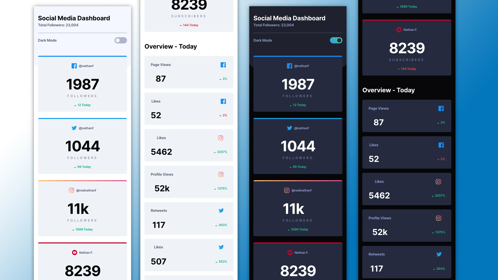

# Frontend Mentor - Challenge

[](https://github.com/jefcooper/fem-social-media-dashboard/actions/workflows/static.yml)

Live on Github Pages: https://jefcooper.github.io/fem-social-media-dashboard

This is a solution to the [Social media dashboard with theme switcher challenge on Frontend Mentor](https://www.frontendmentor.io/challenges/social-media-dashboard-with-theme-switcher-6oY8ozp_H). Frontend Mentor challenges help you improve your coding skills by building realistic projects.

## Table of contents

- [Overview](#overview)
  - [The challenge](#the-challenge)
  - [Screenshot](#screenshot)
  - [Links](#links)
- [My process](#my-process)
  - [Built with](#built-with)
  - [What I learned](#what-i-learned)
  - [Continued development](#continued-development)
  - [Useful resources](#useful-resources)
- [Author](#author)
- [Acknowledgments](#acknowledgments)

## Overview

Three color themes are created as CSS classes. theme--default, theme--dark, and theme--light. The theme--default utilizes @media (prefers-color-scheme: dark/light) to change its definition dynamically based on the system settings. Sass @mixin's are used for the light/dark themes to make them reusable and eliminate duplication when creating theme--default.

All theme classes define a set of custom properties that are used to style the application:

```
.theme {
  --theme-bg: hsl(0, 0, 100%);
  ...
}
```

.theme--default is used on the body element of the document. Javascript is used to query the state of the media and determine initial scheme. An event listener is attached to watch for changes of the media in order to keep toggle buttons in sync with automatically changing system schemes.

A toggle checkbox has a data-color-scheme-toggle attribute that the javascript uses to watch and set the state based on color scheme.

At any time, the user may override the system selection by toggling the checkbox. At this point, the theme--default on body will be programmatically replaced with the desired theme--dark or theme--light.  This preference is also output to localstorage for rehydration when the page is refreshed or reloaded.

The sticky, localstorage state is cleared when the user toggles to a mode matching the system.  This restores the default theme so that automatic day/night shifts happen.

### Screenshot

Desktop:


Mobile:



### Links

- Solution URL: [Github Repository](https://github.com/jefcooper/fem-social-media-dashboard)
- Live Site URL: [Github Pages](https://jefcooper.github.io/fem-social-media-dashboard)

## My process

### Built with

- Semantic HTML5 markup
- CSS custom properties
- Flexbox
- CSS Grid
- Mobile-first workflow
- Github Actions
- Github Pages
- npm / vite

### What I learned

- a simple SaSS + CSS custom properties theme approach
- @media (prefers-color-scheme: "dark")
- javascript event listener on "change" events from media queries

### Bugs and Finishing Steps

### Useful resources

- https://stackoverflow.com/questions/56393880/how-do-i-detect-dark-mode-using-javascript
- https://www.section.io/engineering-education/watch-for-system-dark-mode-using-js-css/
- https://web.dev/building-a-theme-switch-component/

#### Tooling

- https://www.joshwcomeau.com/css/custom-css-reset/
- https://svg-sprite-generator.vercel.app/
- https://medium.com/swlh/better-ways-to-organise-css-properties-9a066e7ded62
- https://www.w3schools.com/howto/howto_css_switch.asp

#### Unsplash

#### My Codepens

## Author

- Website - [Jeff Cooper](https://jefcooper.github.io)
- Frontend Mentor - [@jefcooper](https://www.frontendmentor.io/profile/jefcooper)

## Acknowledgments
